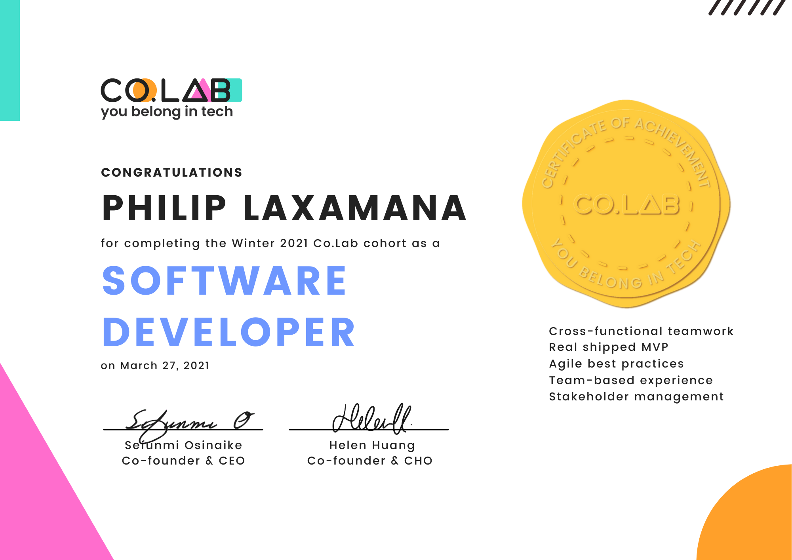
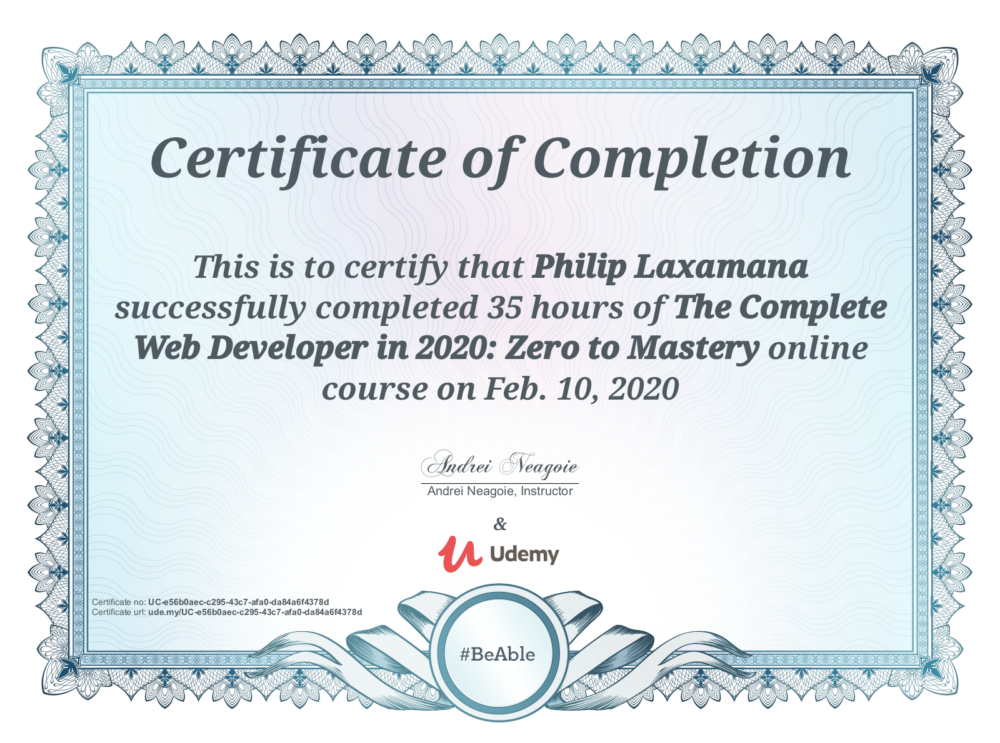
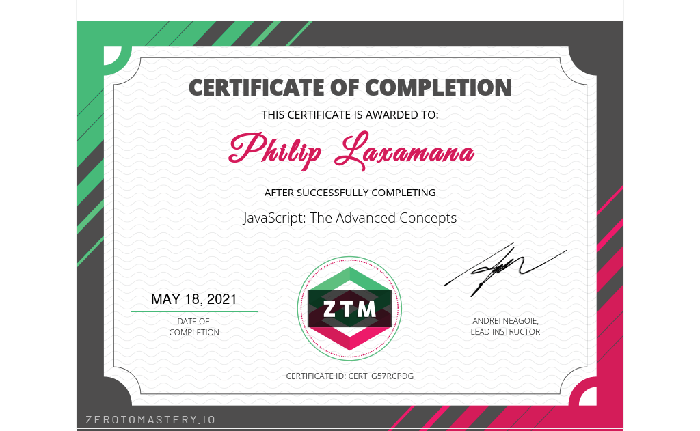
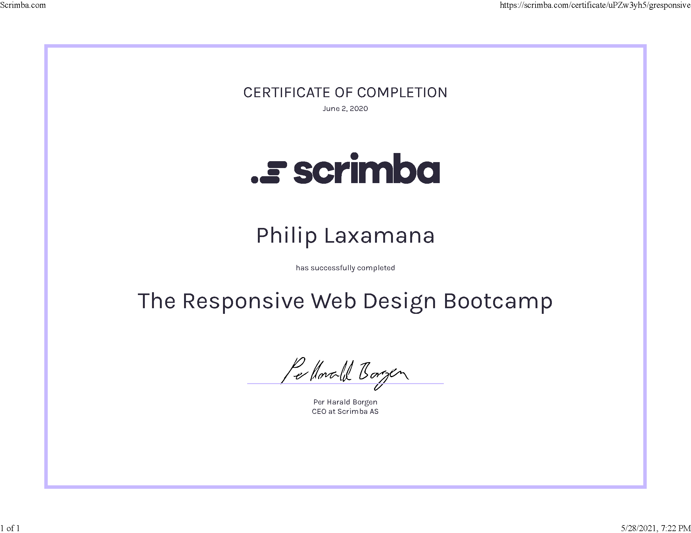
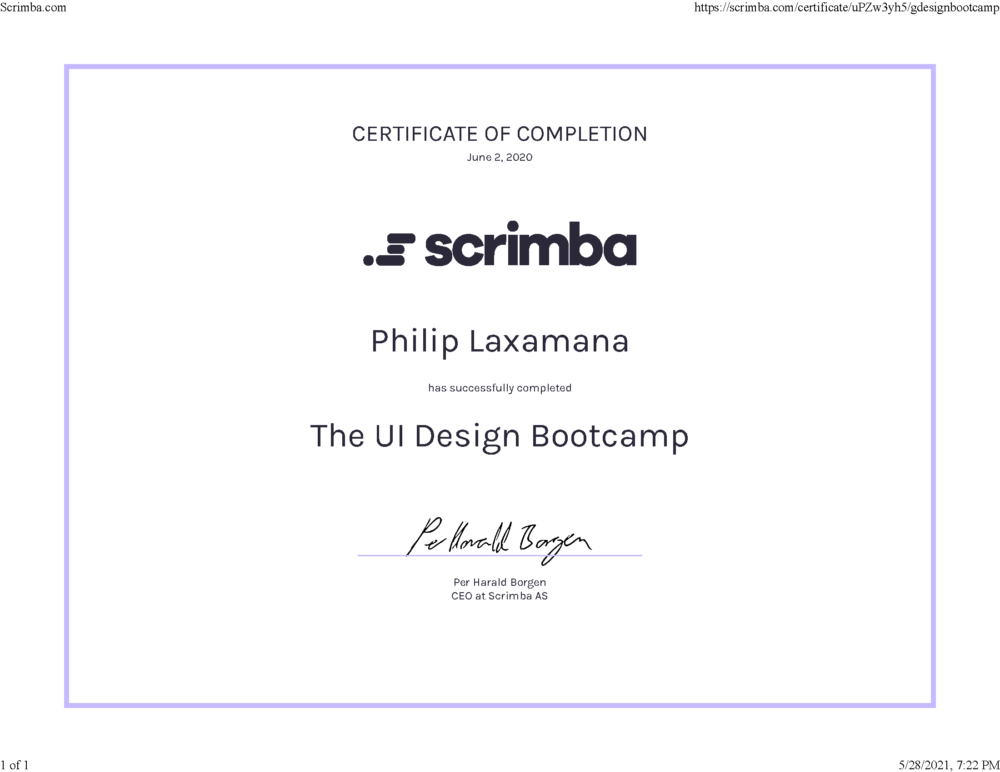
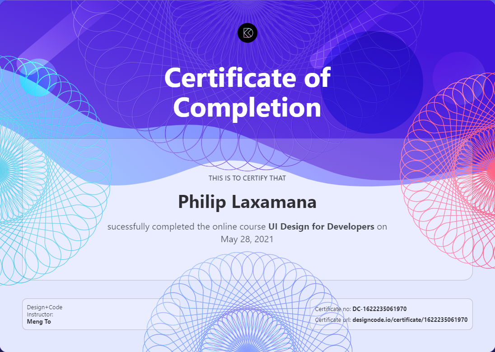
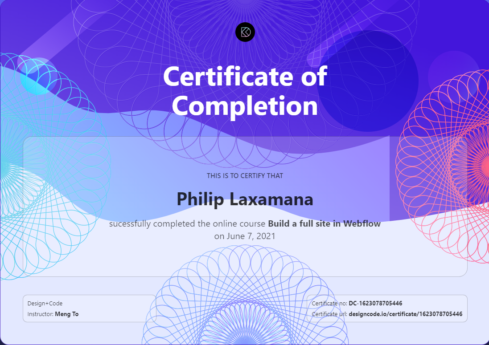

# Certificates

These are certificates from courses and organizations that I've earned.

## [Design Course](https://designcourse.com)
https://designcourse.com/certificate/63a61306b7b365001986f35e

## [Co.Lab](https://www.joincolab.io/) 

## [ZTM - Zero To Mastery](https://zerotomastery.io)

## [Scrimba](https://scrimba.com)

## [Design+Code](https://designcode.io)

